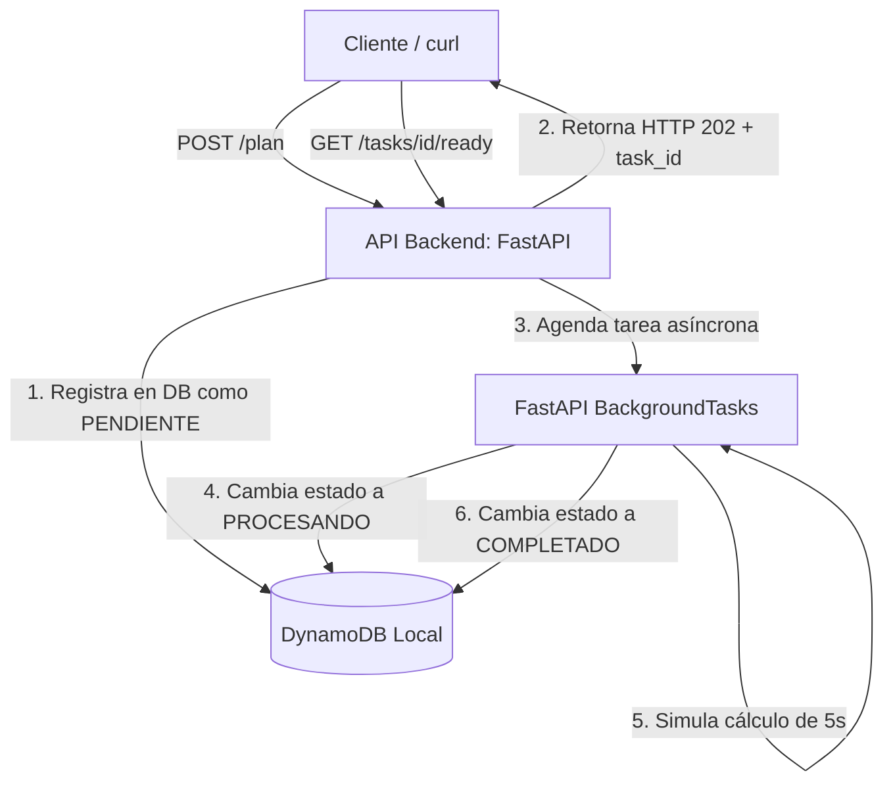

# Sistema Nutricional Asíncrono (FastAPI + AWS DynamoDB)

Este proyecto es un sistema de procesamiento nutricional basado en una arquitectura asíncrona simplificada. Utiliza **FastAPI** para la API del backend, **FastAPI BackgroundTasks** para procesar los planes en segundo plano de manera no bloqueante, y **AWS DynamoDB** para persistir el estado de las tareas.

## 🏗️ Arquitectura

El sistema consta de dos componentes principales orquestados con Docker:

1. **API (FastAPI):** Recibe las solicitudes de planes nutricionales (`POST /plan`), registra el plan como `PENDIENTE` en la base de datos y agenda inmediatamente una tarea en segundo plano (`BackgroundTasks`) para iniciar el cálculo, retornando el control al cliente de inmediato (HTTP 202).
2. **DynamoDB (Base de Datos):** Una instancia de DynamoDB Local que mantiene el estado, trazabilidad y logs de error de cada tarea.



## 🚀 Requisitos

*   [Docker](https://docs.docker.com/get-docker/)
*   [Docker Compose](https://docs.docker.com/compose/install/)

## 🛠️ Instalación y Despliegue

Para levantar la base de datos local y la API, simplemente ejecuta en tu terminal:

```bash
sudo docker compose up --build
```

*(O en segundo plano usando la bandera `-d`):*
```bash
sudo docker compose up --build -d
```

Esto levantará:
*   **API (FastAPI):** [http://localhost:8000](http://localhost:8000)
*   **DynamoDB Local:** `http://localhost:8001` (Internamente mapeado al puerto `8000` de su contenedor)

---

## 🧪 Pruebas de la API (Autenticación y Roles con AWS Cognito)

El sistema ahora está protegido mediante autenticación con **Tokens JWT** (AWS Cognito). Para facilitar el desarrollo y pruebas locales, el sistema cuenta con tokens de prueba ("mock"):
*   **Token Estudiante:** `mock-student-token` (Da acceso a los roles de la agrupación `Estudiantes`).
*   **Token Docente:** `mock-teacher-token` (Da acceso a los roles de la agrupación `Docentes`).

> [!IMPORTANT]
> Si intentas acceder a cualquier endpoint sin el encabezado `Authorization`, recibirás un error `401 Unauthorized`. Si intentas acceder a un endpoint de Docentes con un token de Estudiante, recibirás un error `403 Forbidden`.

---

### 1. Enviar una solicitud de plan nutricional (Acceso: Estudiantes o Docentes)
Puedes enviar una solicitud usando `curl` o cualquier cliente REST, incluyendo la cabecera de autorización:

```bash
curl -X POST http://localhost:8000/plan \
     -H "Content-Type: application/json" \
     -H "Authorization: Bearer mock-student-token" \
     -d '{"paciente_id": 123, "tipo_plan": "Keto"}'
```

**Respuesta esperada (HTTP 202):**
```json
{
  "task_id": "848bb246-8800-4b8a-9861-6d73f4e24ef5",
  "status": "PENDIENTE",
  "message": "Solicitud recibida y registrada",
  "status_url": "/tasks/848bb246-8800-4b8a-9861-6d73f4e24ef5",
  "ready_url": "/tasks/848bb246-8800-4b8a-9861-6d73f4e24ef5/ready",
  "poll_interval_seconds": 2
}
```

### 2. Consultar el estado de la tarea (Polling) (Acceso: Estudiantes o Docentes)
Para verificar el estado de procesamiento de tu plan:

```bash
curl -H "Authorization: Bearer mock-student-token" http://localhost:8000/tasks/TU_TASK_ID/ready
```

**Durante el procesamiento (primeros 5 segundos):**
```json
{
  "task_id": "TU_TASK_ID",
  "ready": false,
  "status": "PROCESANDO",
  "terminal": false,
  "should_continue_polling": true,
  "poll_interval_seconds": 2,
  "updated_at": "2026-06-02T19:10:00.123456"
}
```

**Al finalizar (después de 5 segundos):**
```json
{
  "task_id": "TU_TASK_ID",
  "ready": true,
  "status": "COMPLETADO",
  "terminal": true,
  "should_continue_polling": false,
  "poll_interval_seconds": 2,
  "updated_at": "2026-06-02T19:10:05.123456",
  "finished_at": "2026-06-02T19:10:05.123456"
}
```

### 3. Detalle completo de la tarea (Acceso: Estudiantes o Docentes)
Para obtener todo el registro almacenado en DynamoDB:

```bash
curl -H "Authorization: Bearer mock-student-token" http://localhost:8000/tasks/TU_TASK_ID
```

### 4. Consultar todas las tareas del sistema (Acceso exclusivo: Docentes)
Si intentas realizar esta consulta con un token de estudiante (`mock-student-token`), recibirás un error `403 Forbidden`. Debes utilizar el token de docente:

```bash
curl -H "Authorization: Bearer mock-teacher-token" http://localhost:8000/admin/tasks
```

**Respuesta esperada (HTTP 200):**
Un listado con todas las tareas registradas en la base de datos de DynamoDB.

---

## 📁 Estructura del Proyecto

```text
.
├── api/
│   ├── Dockerfile
│   ├── main.py          # Entrada de la API FastAPI
│   ├── config.py        # Carga centralizada de variables de entorno
│   ├── database.py      # Inicializador y utilidades de DynamoDB
│   ├── models.py        # Esquemas de datos de Pydantic
│   ├── auth.py          # Verificación JWT de Cognito y RBAC
│   ├── tasks.py         # Lógica de tareas asíncronas en segundo plano
│   └── routers/         # Enrutadores modulares de la aplicación
│       ├── __init__.py
│       ├── health.py    # Health check
│       ├── plans.py     # Creación y consulta de planes nutricionales
│       └── admin.py     # Auditoría de tareas para docentes
├── docker-compose.yml   # Orquestación de servicios locales
├── requirements.txt     # Dependencias de Python
├── .env                 # Variables de entorno y credenciales (excluido en git)
└── .gitignore           # Archivos ignorados en control de versiones
```
