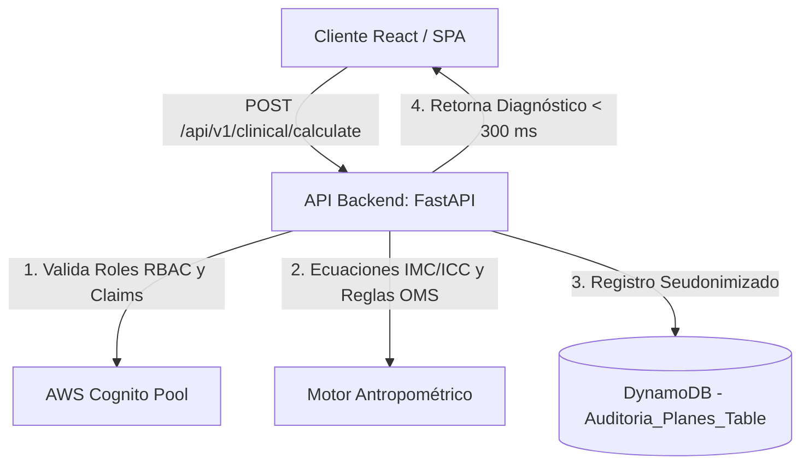

    # Sistema Nutricional NutriA (FastAPI + AWS Cognito + AWS DynamoDB + React SPA)

Este proyecto es una plataforma integral para nutrición y salud clínica orientada a la **Gestión de Expedientes Clínicos y el Motor de Cálculo Antropométrico Síncrono** (v1.0). El sistema implementa las mejores prácticas en seguridad (RBAC) y privacidad de datos de salud bajo estándares internacionales (ISO 25000).

## 🏗️ Arquitectura de la Solución

La solución se compone de tres servicios fundamentales organizados y orquestados mediante contenedores de Docker:

1. **Frontend (React SPA):** Interfaz premium construida sobre la paleta de colores Verde Bosque (`#1E3F20`) y Crema (`#FDFBF7`), expuesta de forma síncrona en el puerto **3000** y consumiendo la API de backend con latencia de renderizado menor a **100 ms**.
2. **API (FastAPI):** Backend en Python expuesto en el puerto **8000**, con soporte completo de políticas CORS restringidas a los dominios locales y a la IP de producción `http://3.134.114.180:3000`. Incluye endpoints legados y endpoints `/api/v1/` firmados por contrato OpenAPI.
3. **DynamoDB (Persistencia):** Utiliza AWS DynamoDB en la nube (o DynamoDB Local) para la persistencia del estado de tareas y el histórico de auditoría antropométrica.



---

## 🚀 Requisitos

*   [Docker](https://docs.docker.com/get-docker/)
*   [Docker Compose](https://docs.docker.com/compose/install/)

---

## 🛠️ Instalación y Despliegue Local

Para levantar la base de datos local (DynamoDB Local), el backend en FastAPI y el frontend en React expuesto en el puerto **3000**, ejecuta en la raíz del proyecto:

```bash
docker compose up --build
```

Esto iniciará:
*   **Frontend (React SPA):** [http://localhost:3000](http://localhost:3000)
*   **API (FastAPI):** [http://localhost:8000](http://localhost:8000)
*   **DynamoDB Local:** `http://localhost:8001` (para desarrollo local)

---

## 🔒 Parámetros de Seguridad e Infraestructura (RBAC & Privacidad)

### 1. Control de Acceso Basado en Roles (RBAC)
*   **Estudiantes:** Autorizados para registrar expedientes y consumir el motor antropométrico (`POST /api/v1/clinical/calculate`). No tienen acceso a rutas de auditoría ni administración.
*   **Docentes (Administradores):** Autorizados para acceder a los tableros de auditoría del sistema. Intentar consumir endpoints administrativos con tokens de estudiante devolverá un error **HTTP 403 Forbidden**.
*   **Validación Local / Mock:**
    *   Token Estudiante: `mock-student-token`
    *   Token Docente: `mock-teacher-token`

### 2. Privacidad y Seudonimización (ISO 25000)
Queda prohibido escribir, almacenar o persistir nombres, correos o números de cédula dentro de los registros de auditoría de la tabla `Auditoria_Planes_Table` de DynamoDB.
*   El motor genera un identificador aleatorio universal `Patient_ID` bajo el estándar **UUIDv4** en cada petición exitosa para garantizar el completo anonimato clínico de los datos de salud.

---

## 🧪 Pruebas de Endpoints (Contratos OpenAPI)

### 1. Motor Antropométrico Síncrono (Acceso: Estudiantes)
Calcula el IMC, clasifica según criterios de la OMS, calcula el ICC, clasifica el riesgo cardiovascular y la distribución de grasa corporal en menos de **300 ms**.

*   **Endpoint:** `POST /api/v1/clinical/calculate` (o `POST /clinical/calculate`)
*   **Encabezado:** `Authorization: Bearer mock-student-token`
*   **Carga Útil de Entrada (JSON):**
```json
{
  "peso_kg": 70.00,
  "estatura_m": 1.75,
  "perimetro_cintura_cm": 100.00,
  "perimetro_cadera_cm": 90.00,
  "sexo_biologico": "Masculino"
}
```

*   **Respuesta Exitosa (HTTP 200):**
```json
{
  "imc": 22.86,
  "imc_clasificacion": "Normal",
  "icc": 1.11,
  "icc_riesgo": "Alto",
  "distribucion_grasa": "Obesidad Androide (Manzana)"
}
```

*   **Lógica de Clasificación:**
    *   **IMC:** Bajo Peso (<18.5), Normal (18.5 a <25), Sobrepeso (25 a <30), Obesidad (>=30).
    *   **ICC (Hombres):** Bajo (<=0.90), Moderado (0.90-0.95), Alto (>0.95 -> Obesidad Androide/Manzana).
    *   **ICC (Mujeres):** Bajo (<=0.80), Moderado (0.80-0.85), Alto (>0.85 -> Obesidad Androide/Manzana).

---

## 📁 Estructura Completa del Proyecto

```text
Sistema-Estudiantes-Nutricion/
├── docker-compose.yml       # Orquestación de servicios (Frontend 3000, API 8000, DynamoDB 8001)
├── requirements.txt         # Dependencias Python
├── frontend/
│   ├── Dockerfile           # Construcción de la imagen React expuesta en el puerto 3000
│   ├── package.json
│   ├── vite.config.js       # Configuración del servidor de desarrollo en puerto 3000
│   └── src/
│       ├── main.jsx
│       ├── App.jsx
│       ├── index.css        # Estilo Forest Green (#1E3F20) y Crema (#FDFBF7)
│       ├── services/
│       │   └── api.js       # Servicio cliente HTTP con llamadas a /api/v1/
│       └── components/
│           ├── LoginRegister.jsx       # Formulario unificado de Login y Registro (cédula y edad validados)
│           ├── Dashboard.jsx           # Panel principal con inyección de JWT e información de Cognito
│           └── AntropometriaForm.jsx   # Formulario interactivo del Motor de Cálculo Clínico
└── api/
    ├── Dockerfile           # Imagen del backend FastAPI expuesta en el puerto 8000
    ├── main.py              # Inicialización de la API, restricciones CORS y carga de routers
    ├── config.py            # Parámetros del pool de Cognito y tablas de DynamoDB
    ├── database.py          # Gestor de conexiones DynamoDB (Tablas: tasks y Auditoria_Planes_Table)
    ├── auth.py              # Middleware JWT y validación RBAC
    ├── models.py            # Modelos Pydantic del backend
    └── routers/
        ├── auth.py          # Rutas de login y registro en Cognito (inyección de cédula en profile)
        ├── plans.py         # Creación y polling asíncrono de planes
        ├── admin.py         # Rutas de administración y auditoría de tareas (Docentes)
        └── clinical.py      # Motor de reglas y cálculos antropométricos (síncrono)
```
