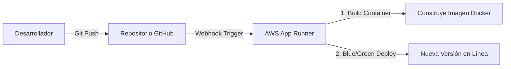

# Informe de Despliegue Técnico y Justificación de Arquitectura en AWS (TFA)

Este documento sirve como el **Informe Técnico de Puesta en Marcha** y la **Guía de Despliegue** para el Trabajo Final de Asignatura (TFA) del **Sistema Nutricional Asíncrono**. Se detalla la justificación de cada componente utilizado en la nube de AWS (orientado a cuentas de AWS Academy / Estudiante) y el paso a paso para conectar la aplicación a los servicios reales de AWS.

---

## 1. Justificación Técnica de la Arquitectura en la Nube (AWS)

La arquitectura propuesta está diseñada para ser resiliente, costo-eficiente y altamente escalable, aprovechando los siguientes pilares de cómputo en la nube de Amazon Web Services (AWS):

### A. Procesamiento (Cómputo)
*   **AWS EC2 (Elastic Compute Cloud) / AWS ECS (Elastic Container Service) con Fargate:**
    *   *Justificación:* Para la ejecución de la API construida en **FastAPI**, se seleccionó un enfoque de contenedores. Para despliegues educativos en AWS Academy, se propone una instancia **t2.micro** o **t3.micro** (elegible en la capa gratuita) configurada con Docker. En entornos de producción, el uso de **AWS ECS con Fargate (Serverless)** elimina la sobrecarga operativa de gestionar sistemas operativos y parches de seguridad, cobrando únicamente por el tiempo exacto de CPU y memoria consumido por el contenedor FastAPI.
    *   *Virtualización y OS:* El microservicio se ejecuta en un contenedor Docker basado en **Debian Slim / Python 3.11**, optimizando el espacio en disco, reduciendo la superficie de ataque de seguridad y garantizando que la aplicación sea portable entre el entorno de desarrollo local y la nube de AWS.

### B. Almacenamiento (Base de Datos NoSQL)
*   **AWS DynamoDB:**
    *   *Justificación:* Para almacenar el estado y la trazabilidad de las solicitudes de planes nutricionales (`PENDIENTE`, `PROCESANDO`, `COMPLETADO`, `FALLIDO`), se utiliza **AWS DynamoDB**.
    *   *Ventajas clave:*
        *   **Serverless:** No requiere provisionar servidores ni administrar clústeres de base de datos.
        *   **Rendimiento:** Latencia de un solo dígito de milisegundo a cualquier escala.
        *   **Modelo de Datos Clave-Valor:** Al estructurarse en torno a un `task_id` (UUID), DynamoDB permite realizar consultas directas (`GetItem`) extremadamente rápidas y eficientes por clave primaria, reduciendo costos de lectura y escritura.
        *   **Capa Gratuita:** DynamoDB ofrece hasta 25 GB de almacenamiento y 25 WCU / 25 RCU de forma totalmente gratuita, lo cual es ideal para presupuestos estudiantiles.

### C. Redes y Seguridad (Networking)
*   **VPC (Virtual Private Cloud) y Security Groups:**
    *   *Justificación:* El contenedor de la API se despliega dentro de una subred pública para recibir tráfico HTTP del cliente. El tráfico está controlado por **Security Groups** que actúan como firewalls virtuales de estado, permitiendo únicamente conexiones entrantes por el puerto `80` (HTTP) y `443` (HTTPS) desde internet.
    *   *Seguridad de Datos:* A diferencia de las bases de datos SQL tradicionales que requieren abrir puertos de red (como el 3306 de MySQL o 5432 de PostgreSQL), DynamoDB se expone a través de endpoints seguros HTTPS controlados mediante políticas de acceso de AWS **IAM (Identity and Access Management)**, eliminando la necesidad de exponer la base de datos a internet.

### D. DevOps e Infraestructura como Código (IaC)
*   **Contenedores y Pipeline:**
    *   *Justificación:* Todo el entorno local se configura mediante **Docker Compose**, lo que permite recrear el ambiente de nube localmente. Para producción, la integración de GitHub Actions permite empaquetar la imagen Docker y subirla a **AWS ECR (Elastic Container Registry)** para su posterior despliegue automatizado.

---

## 2. Paso a Paso para Configurar AWS DynamoDB en la Consola de AWS

Dado que cuentas con una cuenta estudiantil de AWS, sigue estos pasos para configurar la base de datos real en la nube:

1.  **Iniciar sesión en la consola de AWS:**
    *   Entra a tu portal de AWS Academy (o consola estudiantil) y haz clic en **AWS Console**.
2.  **Ir al servicio DynamoDB:**
    *   En la barra de búsqueda superior, escribe **DynamoDB** y selecciona el servicio.
3.  **Crear la Tabla:**
    *   Haz clic en el botón **Crear tabla** (Create table).
    *   **Nombre de la tabla:** Escribe exactamente `tasks`.
    *   **Clave de partición (Partition Key):** Escribe exactamente `task_id` y selecciona el tipo **Cadena** (String / S).
    *   **Clave de ordenación (Sort Key):** Déjalo en blanco.
4.  **Configuración de la Tabla:**
    *   Selecciona **Configuración personalizada** (Custom settings).
    *   **Clase de tabla:** Selecciona *DynamoDB Estándar* (Standard).
    *   **Calculadora de capacidad:** Selecciona **Personalizado** (Customize).
    *   **Capacidad de lectura/escritura (Read/Write capacity):**
        *   Selecciona **Bajo demanda** (On-Demand / Pay-per-request). Esto evitará costos fijos cuando la aplicación no reciba solicitudes, cobrando únicamente fracciones de centavo por petición de lectura o escritura.
5.  **Crear:**
    *   Desplázate al final de la página y haz clic en **Crear tabla**. En unos segundos la tabla estará activa (`ACTIVE`) y lista en la nube de AWS.

---

## 3. Cómo Conectar tu Código a la Cuenta Real de AWS

Nuestra API de FastAPI ya está preparada de manera inteligente: **si detecta que las variables de entorno de AWS real están configuradas, se conectará automáticamente a la nube en lugar de la base de datos local.**

Existen dos métodos de conexión dependiendo de dónde ejecutes la aplicación:

### Método A: Ejecución Local apuntando a AWS Real (Ideal para Pruebas Rápidas)

Si quieres correr el Docker en tu computadora local pero que guarde la información en tu base de datos de AWS real:

1.  **Obtener las Credenciales de tu AWS Academy:**
    *   En tu portal de AWS Academy, haz clic en **AWS Details**.
    *   Verás una sección llamada **AWS CLI Credentials**. Copia los valores de:
        *   `aws_access_key_id`
        *   `aws_secret_access_key`
        *   `aws_session_token` (las cuentas estudiantiles usan tokens temporales obligatoriamente).
2.  **Configurar las Variables de Entorno en el archivo `.env`:**
    *   Crea un archivo llamado `.env` en la raíz de tu proyecto (este archivo está excluido en el `.gitignore` por seguridad).
    *   Añade las credenciales de tu consola estudiantil:
        ```env
        AWS_DEFAULT_REGION=us-east-1
        AWS_ACCESS_KEY_ID=TU_AWS_ACCESS_KEY_ID_REAL
        AWS_SECRET_ACCESS_KEY=TU_AWS_SECRET_ACCESS_KEY_REAL
        AWS_SESSION_TOKEN=TU_AWS_SESSION_TOKEN_COMPLETO
        ```
    *   *Nota Importante:* **NO** definas la variable `DYNAMODB_ENDPOINT_URL` en este archivo `.env`. Al no estar definida, la librería `boto3` sabrá que debe buscar la tabla `tasks` directamente en los servidores de AWS en internet, usando tus credenciales.

3.  **Ejecutar localmente:**
    *   Levanta tu contenedor:
        ```bash
        sudo docker compose up --build
        ```
    *   Haz una petición POST a tu API local. Verás en tu consola de AWS DynamoDB (sección *Explorar elementos de tabla*) cómo se registra la tarea directamente en la nube.

---

### Método B: Ejecución Desplegada en AWS (EC2 / ECS Fargate - Producción)

Cuando subas tu contenedor API a una máquina virtual **EC2** o servicio de contenedores **ECS Fargate** en AWS:

1.  **Seguridad por Roles (Sin contraseñas escritas):**
    *   **NUNCA** debes escribir o guardar archivos con claves de acceso (`AWS_ACCESS_KEY_ID`) en servidores en la nube.
    *   En su lugar, crea un **Rol de IAM** (IAM Role) con permisos para leer y escribir en DynamoDB (política `AmazonDynamoDBFullAccess` o una política personalizada restringida a la tabla `tasks`).
2.  **Asociar el Rol al Servidor:**
    *   Asocia este Rol de IAM al perfil de instancia de tu servidor EC2 o a la definición de tarea (Task Definition) en ECS Fargate.
3.  **El código funciona automáticamente:**
    *   Gracias al cambio estructural implementado en `get_dynamodb_resource()`, la librería `boto3` de Python detectará de manera automática el rol de la máquina de AWS y se autenticará de forma segura sin necesidad de configurar ninguna variable de credenciales en tu `.env` ni en el `docker-compose.yml`.

---

## 4. Gestión de Accesos y Flujo de Despliegue (Responsable: Francisco)

### 4.1. Módulo de Gestión de Usuarios y Roles (AWS Cognito)

#### A. Justificación del Servicio de Identidad Administrado (AWS Cognito)
En sistemas de procesamiento nutricional y clínico, la información manipulada entra en la categoría de **datos de salud altamente sensibles**. Delegar el manejo de identidades y accesos a un desarrollo local en base de datos presenta riesgos críticos de seguridad y cumplimiento legal (normativas HIPAA, RGPD, y leyes locales de derechos de los pacientes). 

Se justifica la adopción de **AWS Cognito** en lugar de una solución propia basada en base de datos local por las siguientes razones:
1.  **Seguridad de Contraseñas Avanzada:** Cognito implementa el protocolo **SRP (Secure Remote Password)**, lo que significa que las contraseñas nunca viajan por la red.
2.  **Cumplimiento de Estándares Internacionales:** AWS Cognito está certificado para cumplir con HIPAA, SOC 1/2/3, ISO 27001, lo cual garantiza de fábrica la encriptación de datos en tránsito y en reposo.
3.  **Características Out-of-the-Box:** Soporta de forma nativa autenticación multifactor (MFA), políticas de complejidad de contraseñas, detección de credenciales comprometidas y bloqueo de cuentas por ataques de fuerza bruta, características complejas y costosas de programar desde cero.

#### B. Configuración de Grupos de Usuarios
Para controlar el acceso y los privilegios dentro de la plataforma del TFA, se definen dos grupos (roles) principales en el User Pool de AWS Cognito:
*   **Estudiantes:** Usuarios con permisos restringidos. Tienen la capacidad de solicitar nuevos planes nutricionales (`POST /plan`) y consultar el estado y detalle de sus tareas asignadas (`GET /tasks/{id}`).
*   **Docentes:** Usuarios administradores. Tienen todos los accesos del estudiante, además de endpoints exclusivos como la auditoría completa de los planes creados en el sistema (`GET /admin/tasks`), lo cual les permite evaluar y monitorear el desempeño de todos los estudiantes.

#### C. Flujo de Autenticación mediante Tokens JWT
El sistema implementa un flujo de autenticación moderno e inalámbrico basado en **OAuth 2.0 / OpenID Connect (OIDC)**:
1.  **Inicio de Sesión:** El cliente envía sus credenciales (usuario y contraseña) directamente al endpoint de autenticación de AWS Cognito.
2.  **Entrega de Tokens:** Tras validar las credenciales, Cognito responde con tres tokens estándar **JWT (JSON Web Tokens)**:
    *   `IdToken`: Contiene la identidad verificada del usuario (nombre, correo) y el listado de grupos al que pertenece (`cognito:groups`).
    *   `AccessToken`: Contiene los permisos de autorización para la API.
    *   `RefreshToken`: Token de larga duración que permite solicitar nuevos tokens de acceso/identidad cuando expiren, sin requerir que el usuario vuelva a ingresar su clave.
3.  **Verificación en la API (FastAPI):**
    *   El cliente incluye el `AccessToken` o `IdToken` en la cabecera HTTP de cada petición: `Authorization: Bearer <JWT>`.
    *   Nuestra API intercepta el token y descarga de forma segura el conjunto de claves públicas **JWKS (JSON Web Key Sets)** desde el endpoint público de Cognito (`jwks.json`).
    *   Se valida la firma criptográfica usando el algoritmo **RS256** (clave asimétrica), la expiración del token (`exp`), el emisor (`iss`) y la audiencia (`aud`).
    *   Finalmente, la API extrae el claim `cognito:groups` y valida si el usuario pertenece al rol requerido para el endpoint, denegando el acceso de inmediato (HTTP 403 Forbidden o HTTP 401 Unauthorized) ante cualquier anomalía.

---

### 4.2. Estrategia de Contenedores y DevOps (Docker + AWS App Runner)

#### A. Adopción de Contenedores (Docker)
Para garantizar la **portabilidad y consistencia** del sistema, se adoptó Docker para empaquetar el microservicio del backend.
*   **Aislamiento:** El contenedor encapsula todas las dependencias del sistema operativo (Python 3.11, librerías como Boto3 y FastAPI, herramientas criptográficas). Esto elimina por completo el clásico problema *"funciona en mi máquina local pero no en el servidor"*.
*   **Eficiencia:** El backend utiliza imágenes basadas en distribuciones ligeras (Debian Slim), minimizando el consumo de recursos de almacenamiento en la nube y acelerando el tiempo de arranque.

#### B. Pipeline de Automatización (DevOps) con AWS App Runner
Para el despliegue automático y continuo, se utiliza **AWS App Runner**, un servicio totalmente administrado de AWS que simplifica el ciclo de vida de los contenedores sin necesidad de configurar balanceadores de carga, VPCs complejas o clústeres de Kubernetes (ECS/EKS).

El flujo de despliegue automatizado (**CI/CD**) funciona bajo el siguiente modelo:



1.  **Integración Continua (GitHub Link):**
    *   AWS App Runner se conecta directamente al repositorio de GitHub mediante autenticación segura.
    *   Se configura un disparador automático (trigger) para que cada `git push` a la rama principal (`main`) active el flujo.
2.  **Construcción Automática:**
    *   Al detectar el commit, App Runner descarga el código, lee la configuración del contenedor (a través de la definición de construcción) y compila la imagen Docker de forma transparente.
3.  **Despliegue Continuo sin Interrupciones (Zero-Downtime Deployment):**
    *   App Runner utiliza una estrategia de despliegue **Blue/Green**.
    *   Primero levanta los contenedores con la *nueva versión* y realiza pruebas de salud (*health checks*).
    *   Una vez que los nuevos contenedores responden correctamente, redirige progresivamente el tráfico de red de los usuarios hacia ellos.
    *   Finalmente, destruye los contenedores antiguos. Esto garantiza que la plataforma del TFA nunca se caiga ni experimente interrupciones de servicio durante las actualizaciones.

