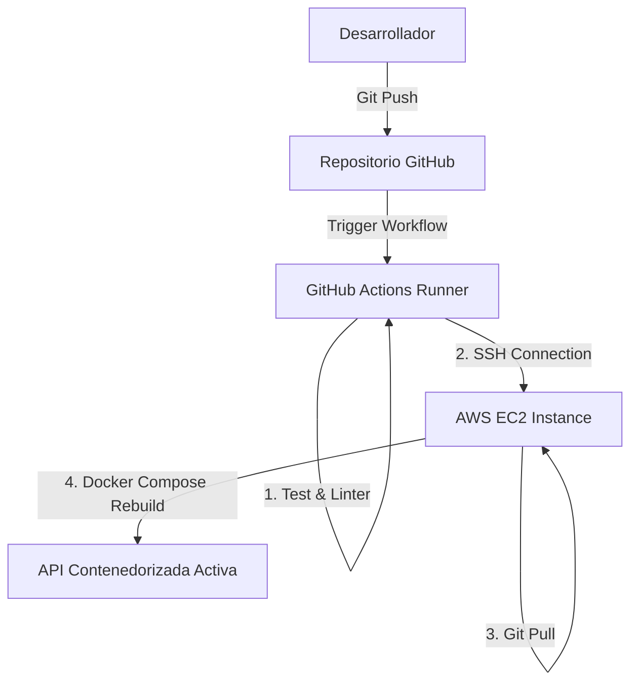

# Informe de Despliegue Técnico y Justificación de Arquitectura en AWS (TFA)

Este documento sirve como el **Informe Técnico de Puesta en Marcha** y la **Guía de Despliegue** para el Trabajo Final de Asignatura (TFA) del **Sistema Nutricional Asíncrono**. Se detalla la justificación de cada componente utilizado en la nube de AWS (orientado a cuentas de AWS Academy / Estudiante) y el paso a paso para conectar la aplicación a los servicios reales de AWS.

---

## 1. Justificación Técnica de la Arquitectura en la Nube (AWS)

La arquitectura propuesta está diseñada para ser resiliente, costo-eficiente y altamente accesible, aprovechando los siguientes pilares de cómputo en la nube de Amazon Web Services (AWS):

### A. Procesamiento (Cómputo)
*   **AWS EC2 (Elastic Compute Cloud) + Docker Compose:**
    *   *Justificación:* Para la ejecución de la API construida en **FastAPI**, se seleccionó un enfoque de contenedores ejecutados en una instancia virtual **t2.micro** (incluida en la capa gratuita y permitida en AWS Academy). Debido a las restricciones de los laboratorios estudiantiles (*sandboxes*), los servicios administrados de alto costo como AWS App Runner no están permitidos. Por ello, el uso de una instancia de EC2 configurada con Docker y Docker Compose representa la solución óptima y permitida, simulando un servidor de producción de nodo único.
    *   *Virtualización y OS:* El microservicio se ejecuta en un contenedor Docker basado en **Debian Slim / Python 3.11** montado sobre un sistema operativo host **Ubuntu Server 22.04 LTS**. Esto garantiza el aislamiento del entorno de ejecución, optimiza el espacio de almacenamiento y elimina fallas por diferencias en dependencias.

### B. Almacenamiento (Base de Datos NoSQL)
*   **AWS DynamoDB:**
    *   *Justificación:* Para almacenar el estado y la trazabilidad de las solicitudes de planes nutricionales (`PENDIENTE`, `PROCESANDO`, `COMPLETADO`, `FALLIDO`), se utiliza **AWS DynamoDB**.
    *   *Ventajas clave:*
        *   **Serverless:** No requiere provisionar servidores ni administrar clústeres de base de datos.
        *   **Rendimiento:** Latencia de un solo dígito de milisegundo a cualquier escala.
        *   **Modelo de Datos Clave-Valor:** Al estructurarse en torno a un `task_id` (UUID), DynamoDB permite realizar consultas directas (`GetItem`) extremadamente rápidas y eficientes por clave primaria, reduciendo costos de lectura y escritura.
        *   **Capa Gratuita:** DynamoDB ofrece hasta 25 GB de almacenamiento y 25 WCU / 25 RCU de forma totalmente gratuita, lo cual es ideal para presupuestos estudiantiles.

### C. Redes y Seguridad (Networking)
*   **VPC (Virtual Private Cloud) y Security Groups:**
    *   *Justificación:* La máquina virtual de EC2 se despliega dentro de una subred pública para recibir tráfico HTTP del cliente. El tráfico está controlado por **Security Groups** que actúan como firewalls virtuales de estado, permitiendo únicamente conexiones entrantes por el puerto `22` (para administración SSH), `80` (HTTP) y el puerto de la API `8000`.
    *   *Seguridad de Datos:* A diferencia de las bases de datos SQL tradicionales que requieren abrir puertos de red (como el 3306 de MySQL o 5432 de PostgreSQL), DynamoDB se expone a través de endpoints seguros HTTPS controlados mediante políticas de acceso de AWS **IAM (Identity and Access Management)**, eliminando la necesidad de exponer la base de datos a internet.

### D. DevOps e Infraestructura como Código (IaC)
*   **Contenedores y Pipeline:**
    *   *Justificación:* Todo el entorno local se configura mediante **Docker Compose**, lo que permite recrear el ambiente de nube localmente. Para producción, se automatiza el despliegue en la instancia EC2 mediante GitHub Actions, permitiendo que cada push compile y actualice los contenedores automáticamente.

---

## 2. Paso a Paso para Configurar AWS DynamoDB en la Consola de AWS

Dado que cuentas con una cuenta estudiantil de AWS, sigue estos pasos para configurar la base de datos real en la nube:

1.  **Iniciar sesión en la consola de AWS:**
    *   Entra a tu portal de AWS Academy (o consola estudiantil) y haz clic en **AWS Console**.
2.  **Ir al servicio DynamoDB:**
    *   En la barra de búsqueda superior, escribe **DynamoDB** y selecciona el servicio.
3.  **Crear la Tabla:**
    *   Haz clic en el botón **Crear tabla** (Create table).
    *   **Nombre de la tabla:** Escribe exactamente `tasks`.
    *   **Clave de partición (Partition Key):** Escribe exactamente `task_id` y selecciona el tipo **Cadena** (String / S).
    *   **Clave de ordenación (Sort Key):** Déjalo en blanco.
4.  **Configuración de la Tabla:**
    *   Selecciona **Configuración personalizada** (Custom settings).
    *   **Clase de tabla:** Selecciona *DynamoDB Estándar* (Standard).
    *   **Calculadora de capacidad:** Selecciona **Personalizado** (Customize).
    *   **Capacidad de lectura/escritura (Read/Write capacity):**
        *   Selecciona **Bajo demanda** (On-Demand / Pay-per-request). Esto evitará costos fijos cuando la aplicación no reciba solicitudes, cobrando únicamente fracciones de centavo por petición de lectura o escritura.
5.  **Crear:**
    *   Desplázate al final de la página y haz clic en **Crear tabla**. En unos segundos la tabla estará activa (`ACTIVE`) y lista en la nube de AWS.

---

## 3. Cómo Conectar tu Código a la Cuenta Real de AWS

Nuestra API de FastAPI ya está preparada de manera inteligente: **si detecta que las variables de entorno de AWS real están configuradas, se conectará automáticamente a la nube en lugar de la base de datos local.**

Existen dos métodos de conexión dependiendo de dónde ejecutes la aplicación:

### Método A: Ejecución Local apuntando a AWS Real (Ideal para Pruebas Rápidas)

Si quieres correr el Docker en tu computadora local pero que guarde la información en tu base de datos de AWS real:

1.  **Obtener las Credenciales de tu Cuenta de AWS:**
    *   En tu consola de AWS IAM, utiliza las claves de acceso de tu usuario administrador o copia las credenciales de tu laboratorio en el menú **AWS Details** -> **AWS CLI Credentials**.
2.  **Configurar las Variables de Entorno en el archivo `.env`:**
    *   Crea un archivo llamado `.env` en la raíz de tu proyecto (este archivo está excluido en el `.gitignore` por seguridad).
    *   Añade las credenciales de tu consola:
        ```env
        AWS_DEFAULT_REGION=us-east-2
        AWS_ACCESS_KEY_ID=TU_AWS_ACCESS_KEY_ID_REAL
        AWS_SECRET_ACCESS_KEY=TU_AWS_SECRET_ACCESS_KEY_REAL
        AWS_SESSION_TOKEN=
        COGNITO_USER_POOL_ID=us-east-2_XXXXXXXX
        COGNITO_APP_CLIENT_ID=XXXXXXXXXXXXXXXXXXXXXXXXXX
        DYNAMODB_ENDPOINT_URL=
        ```
    *   *Nota Importante:* Deja `DYNAMODB_ENDPOINT_URL` vacío. Al no estar definido, la librería `boto3` sabrá que debe buscar la tabla `tasks` directamente en los servidores de AWS en internet, usando tus credenciales.

3.  **Ejecutar localmente:**
    *   Levanta tu contenedor:
        ```bash
        sudo docker compose up --build -d
        ```
    *   Haz una petición POST a tu API local. Verás en tu consola de AWS DynamoDB (sección *Explorar elementos de tabla*) cómo se registra la tarea directamente en la nube.

---

### Método B: Ejecución Desplegada en AWS (EC2 - Producción)

Cuando subas tu contenedor API a tu máquina virtual **EC2** en AWS:

1.  **Seguridad por Roles (Sin contraseñas escritas):**
    *   **NUNCA** debes escribir o guardar archivos con claves de acceso (`AWS_ACCESS_KEY_ID`) en servidores en la nube en entornos reales.
    *   En su lugar, asocia un **Rol de IAM** a tu instancia EC2 que posea la política `AmazonDynamoDBFullAccess` y acceso a Cognito.
2.  **El código funciona automáticamente:**
    *   Gracias al diseño modular implementado en `api/database.py`, la librería `boto3` de Python detectará de manera automática el rol de la máquina de AWS y se autenticará de forma segura sin necesidad de configurar claves estáticas en el archivo `.env` del servidor.

---

## 4. Gestión de Accesos y Flujo de Despliegue (Responsable: Francisco)

### 4.1. Módulo de Gestión de Usuarios y Roles (AWS Cognito)

#### A. Justificación del Servicio de Identidad Administrado (AWS Cognito)
En sistemas de procesamiento nutricional y clínico, la información manipulada entra en la categoría de **datos de salud altamente sensibles**. Delegar el manejo de identidades y accesos a un desarrollo local en base de datos presenta riesgos críticos de seguridad y cumplimiento legal (normativas HIPAA, RGPD, y leyes locales de derechos de los pacientes). 

Se justifica la adopción de **AWS Cognito** en lugar de una solución propia basada en base de datos local por las siguientes razones:
1.  **Seguridad de Contraseñas Avanzada:** Cognito implementa el protocolo **SRP (Secure Remote Password)**, lo que significa que las contraseñas nunca viajan por la red de forma legible.
2.  **Cumplimiento de Estándares Internacionales:** AWS Cognito está certificado para cumplir con HIPAA, SOC 1/2/3, ISO 27001, lo cual garantiza de fábrica la encriptación de datos en tránsito y en reposo.
3.  **Características Out-of-the-Box:** Soporta de forma nativa autenticación multifactor (MFA), políticas de complejidad de contraseñas, detección de credenciales comprometidas y bloqueo de cuentas por ataques de fuerza bruta, características complejas y costosas de programar desde cero.

#### B. Configuración de Grupos de Usuarios
Para controlar el acceso y los privilegios dentro de la plataforma del TFA, se definen dos grupos (roles) principales en el User Pool de AWS Cognito:
*   **Estudiantes:** Usuarios con permisos restringidos. Tienen la capacidad de solicitar nuevos planes nutricionales (`POST /plan`) y consultar el estado y detalle de sus tareas asignadas (`GET /tasks/{id}`).
*   **Docentes:** Usuarios administradores. Tienen todos los accesos del estudiante, además de endpoints exclusivos como la auditoría completa de los planes creados en el sistema (`GET /admin/tasks`), lo cual les permite evaluar y monitorear el desempeño de todos los estudiantes.

#### C. Flujo de Autenticación mediante Tokens JWT
El sistema implementa un flujo de autenticación moderno basado en **OAuth 2.0 / OpenID Connect (OIDC)**:
1.  **Inicio de Sesión:** El cliente envía sus credenciales (usuario y contraseña) directamente al endpoint de autenticación de AWS Cognito.
2.  **Entrega de Tokens:** Tras validar las credenciales, Cognito responde con tres tokens estándar **JWT (JSON Web Tokens)**:
    *   `IdToken`: Contiene la identidad verificada del usuario (nombre, correo) y el listado de grupos al que pertenece (`cognito:groups`).
    *   `AccessToken`: Contiene los permisos de autorización para la API.
    *   `RefreshToken`: Token de larga duración que permite solicitar nuevos tokens de acceso/identidad cuando expiren, sin requerir que el usuario vuelva a ingresar su clave.
3.  **Verificación en la API (FastAPI):**
    *   El cliente incluye el `AccessToken` o `IdToken` en la cabecera HTTP de cada petición: `Authorization: Bearer <JWT>`.
    *   Nuestra API intercepta el token y descarga de forma segura el conjunto de claves públicas **JWKS (JSON Web Key Sets)** desde el endpoint público de Cognito (`jwks.json`).
    *   Se valida la firma criptográfica usando el algoritmo **RS256** (clave asimétrica), la expiración del token (`exp`), el emisor (`iss`) y la audiencia (`aud`).
    *   Finalmente, la API extrae el claim `cognito:groups` y valida si el usuario pertenece al rol requerido para el endpoint, denegando el acceso de inmediato (HTTP 403 Forbidden o HTTP 401 Unauthorized) ante cualquier anomalía.

---

### 4.2. Estrategia de Contenedores y DevOps (Docker + AWS EC2)

#### A. Adopción de Contenedores (Docker)
Para garantizar la **portabilidad y consistencia** del sistema, se adoptó Docker para empaquetar el microservicio del backend y del frontend.
*   **Aislamiento:** El contenedor encapsula todas las dependencias del sistema operativo (Python 3.11, librerías como Boto3 y FastAPI, herramientas criptográficas). Esto elimina por completo el clásico problema *"funciona en mi máquina local pero no en el servidor"*.
*   **Eficiencia:** El backend utiliza imágenes basadas en distribuciones ligeras (Debian Slim), minimizando el consumo de recursos de almacenamiento en la nube y acelerando el tiempo de arranque.

#### B. Pipeline de Automatización (DevOps) con GitHub Actions y AWS EC2
Para el despliegue automático y continuo dentro de las limitaciones de AWS Academy, se utiliza un pipeline de integración y entrega continua (CI/CD) basado en **GitHub Actions** conectado por SSH a la instancia de **AWS EC2**.

El flujo de despliegue automatizado funciona bajo el siguiente modelo:



1.  **Integración Continua (CI):**
    *   El desarrollador sube los cambios al repositorio de GitHub. Un flujo de GitHub Actions valida el código mediante pruebas unitarias y análisis de estilo (*linters*).
2.  **Entrega Continua (CD):**
    *   Una vez que las pruebas pasan exitosamente, la tarea de GitHub Actions inicia una conexión SSH segura (utilizando llaves criptográficas privadas) con la máquina virtual de AWS EC2.
3.  **Despliegue sin Interrupción en el Host:**
    *   El runner ejecuta comandos dentro del servidor EC2 para descargar el código más reciente (`git pull`).
    *   Posteriormente, ejecuta `docker compose up --build -d` para reconstruir la imagen Docker únicamente con los cambios recibidos y reiniciar el contenedor de la API en segundo plano.
    *   Esto permite automatizar por completo el despliegue, logrando actualizaciones veloces en cuestión de segundos y garantizando que el servicio web esté en línea continuamente para los usuarios.
